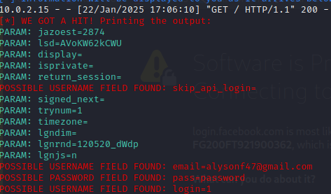

# Phishing para captura de senhas do Facebook

### Ferramentas Utilizadas:

Kali Linux
Setoolkit

### Comandos digitados no terminal

````Sudo```` su: para poder acessar o modo root

```Setoolkit```: para poder acessar o menu de opções

```Social-Engineering Attacks```: para acessar as configurações de ataque

```Web Site Attack Vectors```: para poder realizar o ataque via web

```Credential Harvester Attack Method```: selecionando o método de ataque (pegando as credenciais)

``` Site Cloner ```: Método de clonar o site
Url utilizada: http://www.facebook.com

### Resutados


